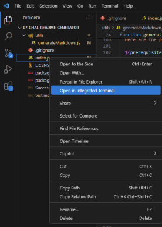

  # Vehicle Customizer
  
  
  
  ## About

  The Vehicle Customizer is a backend application that allows you to access a collection of vehicles created by you and perform various actions with these vehicles via command line operation. The actions you perform can also vary based on the type of vehicle you decide to select.
   

   
  ## Table of Contents 
  - [Installation](#installation)
  - [Usage](#usage)
  - [Contributing](#contributing)
  - [Tests](#tests)
  - [License](#license)
  - [Questions](#questions)
   

   
  ## Installation
   
  Here are the prerequisites necessary to use the project:
   
  1. Nodejs
2. npm
3. Typescript
4. Inquirer

  
  To get started with the project, follow these steps:
   
  1. Visit nodes website [here](https://nodejs.org/en/download) to download node.
2. Open the terminal in your code editor and run the code ` node -v ` to check if node has been installed.
3. NPM should be automatically installed alongside node. To make sure, run the code ` npm -v ` in the terminal.
4. Finally, npm is used to install **both** inquirer and typescript. As it is a dependency already listed in the repositories *package.json* file, simply run the code ` npm i `, and this will be installed.

   

   
  ## Usage 
   
  Here are the steps to start the application:
   
  1. Open an integrated terminal for the index.js file as shown below: 

       
  
  *via VSCode*

2. Run the code `npm start` in the terminal

  
  To use the application, do the following:

  Once the application is started, it will initiate a series of prompts in the terminal asking you questions to answer. The first type of prompts are list prompts, which gives you a series of options to choose from. You can navigate these options using your arrow keys, and once your desired answer is highlighted, press enter. The other type of prompts are input prompts, where you can type out your answers and hit enter to enter it into the system. 
  
  The first questions you will be asked upon starting the application are whether you would like to create a new vehicle or perform an action on an existing vehicle. Selecting create new will initiate a series of prompts asking you about the type of vehicle you want to create and details about it. 
  > **note** Some of the input prompts will ask you questions that warrant a number (any other value input in these fields will break the output later on). The weight number will be displayed in pounds (lbs), top speed in miles per hour (mph), and wheel diameter in inches. 
  
  The option of performing an action on an existing vehicle will allow you to select from a list of vehicles you created and the default vehicles on the application. Once you either create or choose a vehicle, you can select from a series of actions that will be logged in the console. The option “tow a vehicle” can only be used if the selected vehicle is a truck, and the option “wheelie” can only be used if the selected vehicle is a motorbike.

  **Follow this video tutorial for a visual step by step guide on starting and using the application**: [Tutorial](https://drive.google.com/file/d/1VCH1YsfAqfpedfi76twiE1XT0s3TgY-q/view?usp=sharing)
    
  ## Contributing
   
  Any contributions are appreciated as they are vital to the improvement and wellbeing of the project.

  If you would like to contribute, please follow these steps:

  1. **Fork the repository** to your own github account
2. **Clone the forked repository** to your local machine
3. **Create a branch** for your changes
4. **Make your changes**, while ensuring they follow the project’s standards
5. **Test your changes** to verify they work
6. **Commit your changes** with a descriptive commit message
7. **Push the changes** to your forked repository
8. **Submit a pull request** from your branch to the main repository with a detailed description of the changes and any potential issues.
9. **Be responsive to feedback** and make any updates necessary.

   

   
  ## Tests
   
  In order to run tests on the project, do the following:
   
  *Tests are not yet available for this project*
   

   
  ## License 
   
  This application is covered under the MIT License. For more information, view the official documentation [here](https://opensource.org/license/MIT).
   

   
  ## Questions
   
  For any questions or assistance, please reach out through these mediums:
   
  - **Github:** [zachmc27](https://github.com/zachmc27)
  - **Email:** <dzdudes1213@gmail.com>

  